# Red Hat Single Sign On Walkthrough

## Description

This demo showcase a step-by-step guide covering basic capabilities from [Red Hat Single Sign ON](https://access.redhat.com/products/red-hat-single-sign-on) using a simple application js-console.

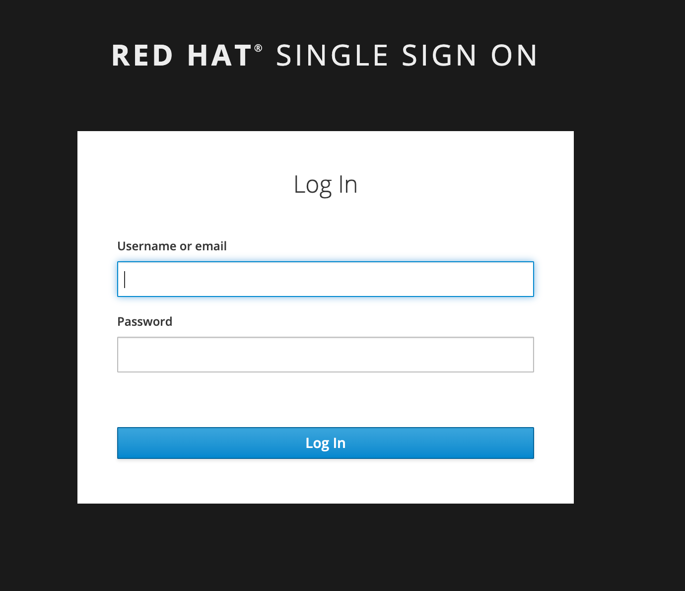

js-console and Red Hat SSO running on Openshift.

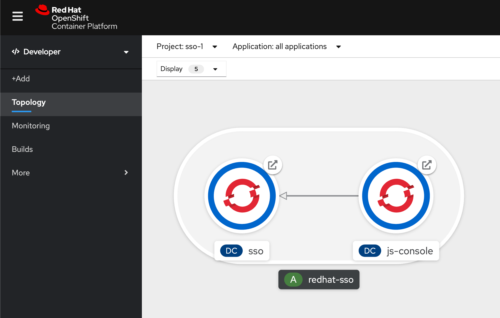

## For instructor only

### RHPDS

If you want to use it on RHPDS, create a new Openshift environment using OCP 4.4.


#### User Projects

```bash
# change this according to the number of expected users
NUMBER_OF_USERS=5

for userNumber in $(seq 1 $NUMBER_OF_USERS);do
  #oc adm new-project sso-${userNumber} 
  oc adm new-project sso${userNumber} --admin=user${userNumber}
done
```

#### Etherpad

To install etherpad, please check https://github.com/luszczynski/openshift-etherpad

Use the following script to generate a list of users.

```bash
NUMBER_OF_USERS=20

for userNumber in $(seq 1 $NUMBER_OF_USERS);do
  echo "user${userNumber}="
done
``` 

#### Building from Source

Source code artifacts are available in *source* directory. No need to build/compile anything since we're using *JavaScript* and *HTML*.

Docker assets are available in *docker* directory. In order to modify those images, just change *Dockerfile-js-console* or *Dockerfile-rhsso-73* files as needed and execute *docker build -t* from *root* directory . Example:

```bash
  docker build -t rhsso-js-console-app:1.0 -f docker/Dockerfile-js-console .
  docker build -t rhsso73:1.0 -f docker/Dockerfile-rhsso-73 .
```

## For regular users

### Demo Script

0. [Before we begin](#0.-before-we-begin)
1. [Starting RHSSO and JS Console App](#1.-starting-rhsso-and-js-console-app)
2. [Create RHSSO Realm](#2.-create-rhsso-realm)
3. [Create RHSSO Client APP](#3.-create-rhsso-client-app)
4. [Create RHSSO Roles](#4.-create-rhsso-roles)
5. [Create RHSSO User](#demo-step-5)
6. [Enable SignUp](#demo-step-6)
7. [Change Themes](#demo-step-7)
8. [User Required Actions](#demo-step-8)
9. [Social Login](#demo-step-9)
10. [Two Factor with OTP](#demo-step-10)
11. [End User Account Management](#demo-step-11)

#### 0. Before we begin

During the labs, we will need the Openshift URL:

* The instructor must provide this URL problably using the Etherpad service

Save the Openshift URL as we are going to need them in the labs.

#### 1. Starting RHSSO and JS Console App

##### 1.1 Locally

* Execute *docker pull* to download both **Red Hat Single Sign ON** and **JS Console App:**
  ```
  docker pull viniciusmartinez/rhsso73:1.0
  docker pull viniciusmartinez/sso-console-app:1.0
  ```
* Bootstrap both **Red Hat Single Sign ON** and **JS Console App:**

  ```
  docker run -it -p 8080:8080 viniciusmartinez/rhsso73:1.0
  docker run -it -p 80:80 viniciusmartinez/sso-console-app:1.0
  ```
  * if you modify **Red Hat Single Sign ON** default port don't forget to update *keycloak.json;*
* Open a browser of your choice and try to access **Red Hat Single Sign ON** on the following address with *admin/admin* credentials: http://localhost:8080/auth
* Open a new tab and try to access **JS Console App** on the following address: http://localhost:80

##### 1.2 Openshift

First, we need to login on Openshift.

* Username: user`XX` (where XX is your specific number)
* Password: `openshift`


Make sure you are in the `Developer perspective` and in the namespace sso`XX`.


###### Deploy SSO

* Click on `+Add` -> `From Catalog`
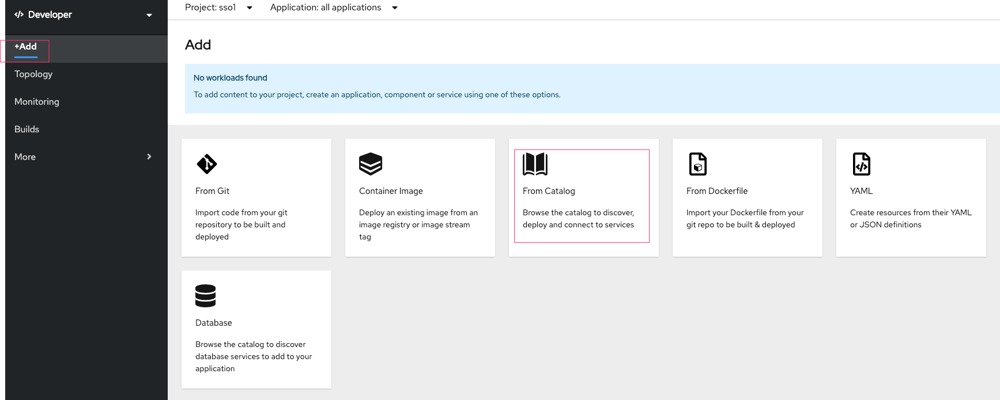
* Search for `sso` in the field search and select `Red Hat Single Sign-On 7.3 (Ephemeral)`

* Click on `Instantiatee Template`

* Leave the fields as they are and just change the `RH-SSO Administrator Username` and `RH-SSO Administrator Password` to `admin`
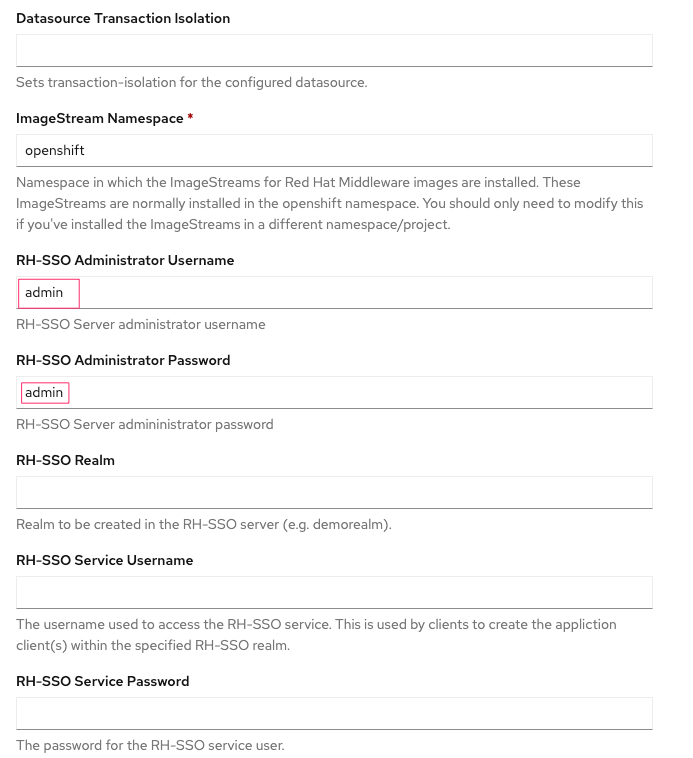
* Wait while Openshift pull the necessary images for Red Hat SSO. When it has finished, you'll see the following screen
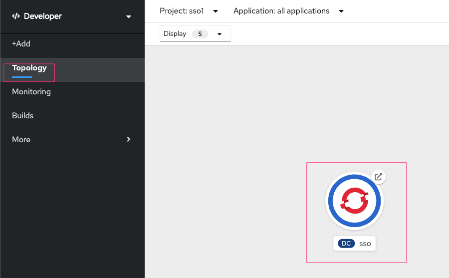

###### Deploy js-console

* Click on `+Add` -> `Container Image`

* Use `docker.io/luszczynski/rhsso-js-console-app:1.0` in the `Image name from external registry`
* Application Name: `redhat-sso`
* Name: `js-console`

* Now click on `Create`
* Click on the SSO circle and then on the resources tab, copy the Routes URL

* Open the js-console Deployment by clicking on `js-console`

* Now select the `Environment` tab and create a new env `AUTH_SERVER_URL` and fill the value field with the content of the URL of SSO. In the end of the SSO URL, add `/auth`. Click on `Save`
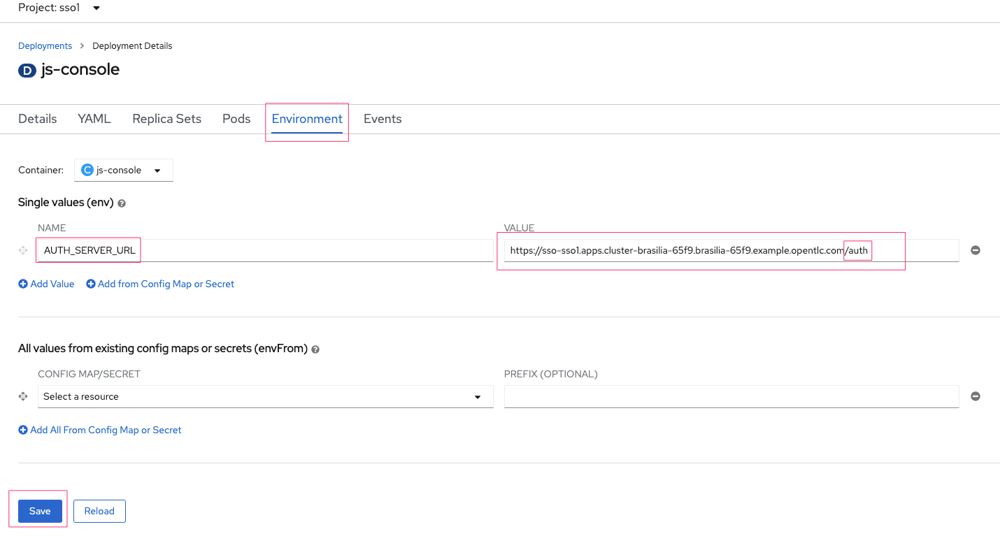
* Switch back to the topology view and Open the js-console app by click on the icon
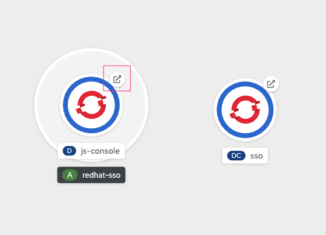

###### Grouping js-console and SSO

* While holding down `Shift`, drag the SSO circle near to the js-console
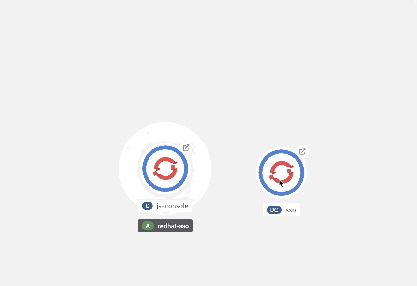
* Now create a connection between js-console and sso by pulling an arrow from js-console towards sso circle


###### Using the CLI

All steps that were executed above, could be done using the following commands

```bash
userNumber=1

oc new-app \
    --template=sso73-x509-https \
    -p APPLICATION_NAME=sso \
    -p SSO_ADMIN_USERNAME=admin \
    -p SSO_ADMIN_PASSWORD=admin \
    -n sso${userNumber}

  ROUTE_PATH=https://$(oc get --no-headers route sso -o jsonpath='{.spec.host}' -n sso${userNumber})/auth

  oc new-app \
    docker.io/luszczynski/rhsso-js-console-app:1.0 \
    AUTH_SERVER_URL=$ROUTE_PATH \
    --name=js-console \
    -n sso${userNumber}

  oc expose svc js-console -n sso${userNumber}

  oc label dc js-console app.kubernetes.io/part-of="redhat-sso" -n sso${userNumber}
  oc label dc sso app.kubernetes.io/part-of="redhat-sso" -n sso${userNumber}
  oc annotate svc js-console app.openshift.io/connects-to=sso73-x509-https -n sso${userNumber}
  oc annotate dc js-console app.openshift.io/connects-to=sso73-x509-https -n sso${userNumber}
```

#### 2. Create RHSSO Realm

* Return to the **Red Hat Single Sign ON** browser tab and place the mouser on the left top corner, right above the *Master*. Click on the arrow button and select **Add Realm**;
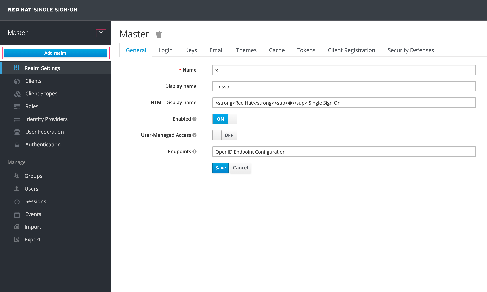
* In the *name* textfield use: *demo*;
* Click on *Create*;


#### 3. Create RHSSO Client App

* Click on *Clients* right bellow the *Realm Settings* at the left menu;
* Click on *Create* button on the right corner;

* On the *Client ID* textfield, use: *js-console*
* Inform the *Root URL*: Paste the URL from js-console that you generate on lab 0.
* Click on **Save** button;


#### 4. Create RHSSO Roles

* Click on **Roles** right bellow the **Client Templates** at the left menu;
* Click on *Add Role* button;

* Inform a *Role Name* (e.g: realm-role) and click on **Save** button afterward;

* Click on **Clients** right bellow the **Realm Settings** at the left menu;
* Select **js-console** and **Roles** afterward;


* Click on **Add Role** button;

* Inform a *Role Name* (e.g: client-role) and afterwards **Save** button;

* Click on **Roles** again;
* Select *Default Roles;*

* Select any role available *Available Roles* list and click on **Add Selected;**
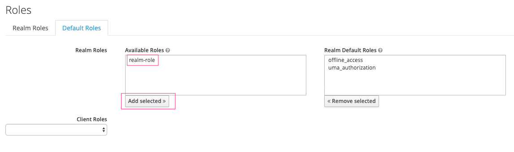
* In the *Client Roles* select **js-console** and click on **Add Selected;**


#### 5. Create RHSSO User <a name="demo-step-5"/>

* Click on **Users** right bellow the **Groups** at the left menu;
* Click on *Add User* button;

* Inform the *Username* `myuser` and click on **Save** button;

* Got to *Credentials* tab and inform the password `mypass`;
* Change *Temporary* to **OFF**;
* Finally click on **Reset Password**;

* Switch back to **JS Console App (The url you got on step 0)** and click on **Login**

* The **Red Hat Single Sign ON** login page will be displayed. Inform the credentials from the user you've created on previous step;
  * user: `myuser`
  * pass: `mypass`
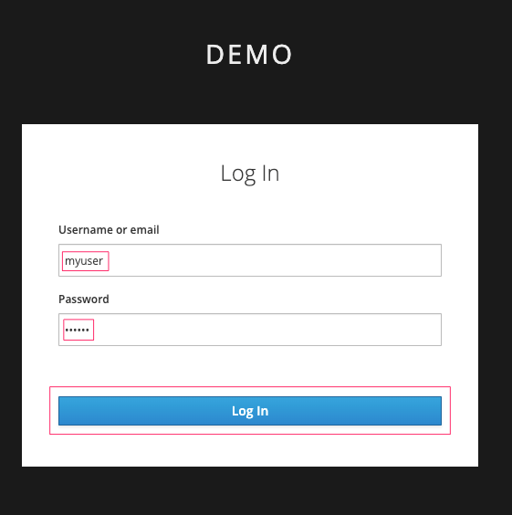
* If everything is properly configured, after a successfully login you will be redirected to the **JS Console App**. Please notice the **Init Success (Authenticated)** right below the *Result* label;
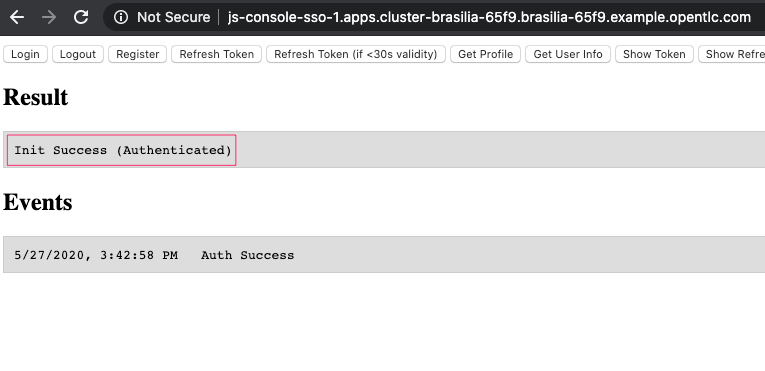
* Considering exploring all buttons (Get Profile, Get User Info, Show Token) to familiarize yourself with *OpenID/OAuth* standards;

#### 6. Enable SignUp <a name="demo-step-6"/>

* Go back to **JS Console App** and click on **Logout**

* Switch back to **Red Hat Single Sign ON** and click on **Realm Settings** right bellow the **Realm Name (Demo)** and select *Login;*
* Enable *User Registration*
* Click on **Save**
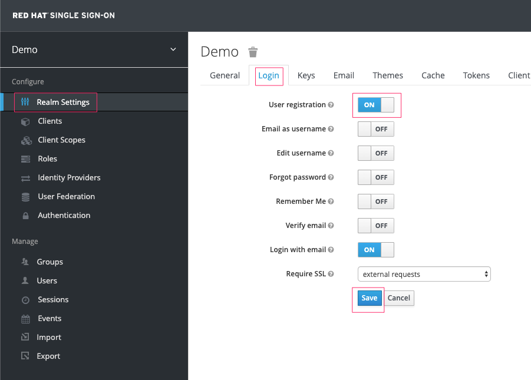
* On **JS Console App** click on **Login** button;

* Click on **Register** and create a new user informing all required fields;

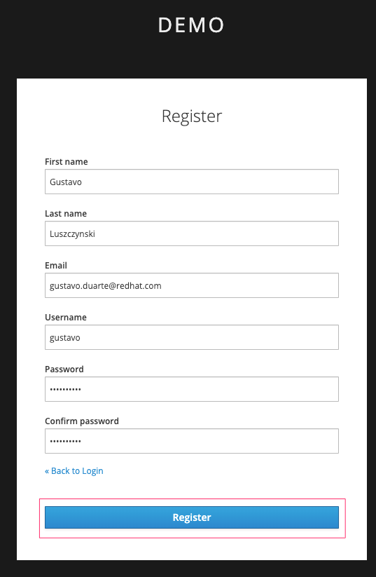
* * if you experience session issues with other users, considering open a new browser instance or an incognito tab;

#### 7. Change Themes <a name="demo-step-7"/>

* Go to **JS Console App** and click on **Logout;**

* On **Red Hat Single Sign ON**, click **Realm Settings** and select **Themes** tab;
* Select theme `keycloak` from **Login Theme** dropdown list;
* Click on **Save;**
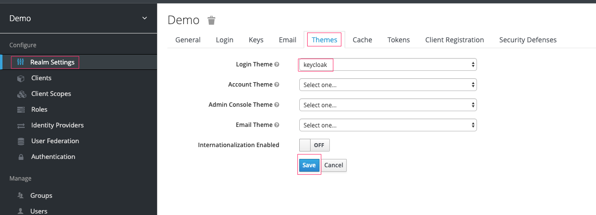
* Go back to **JS Console App (http://localhost:80)** and click on **Login;**

* Notice  a different look'n'feel from **Red Hat Single Sign ON** login page;
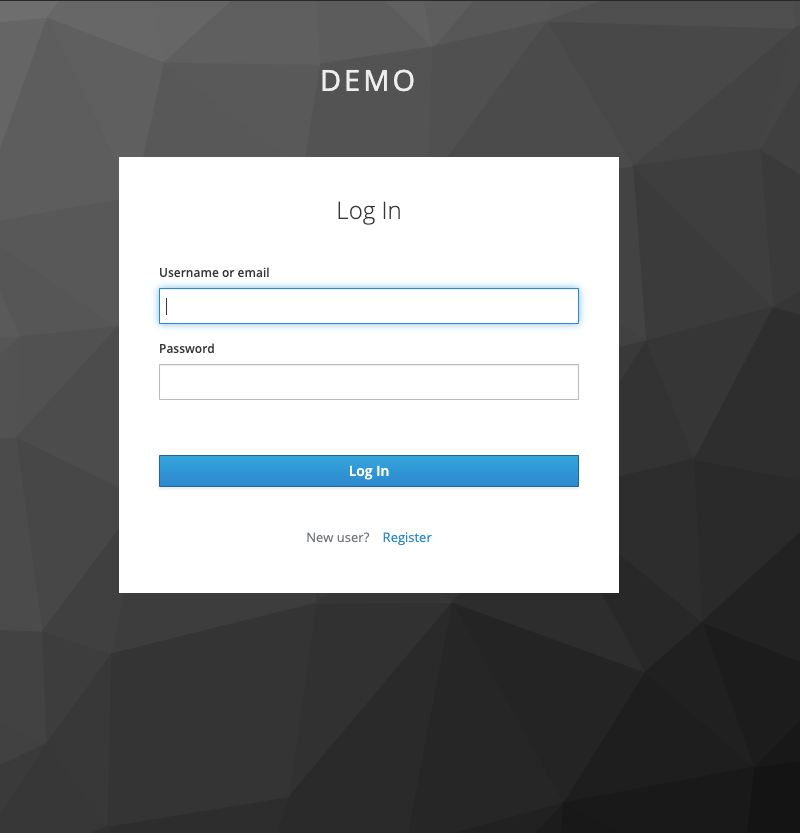

#### 8. User Required Actions <a name="demo-step-8"/>

* Click on **Users** right bellow the **Groups** at the left menu;
* Click on *View all users* button and select one;
* Select an user by clicking on *Edit*;
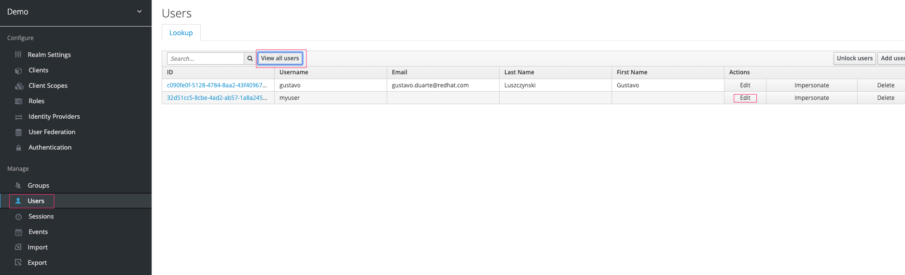
* Select `Update Password` action on **Required User Actions** menu;
* Click on **Save**
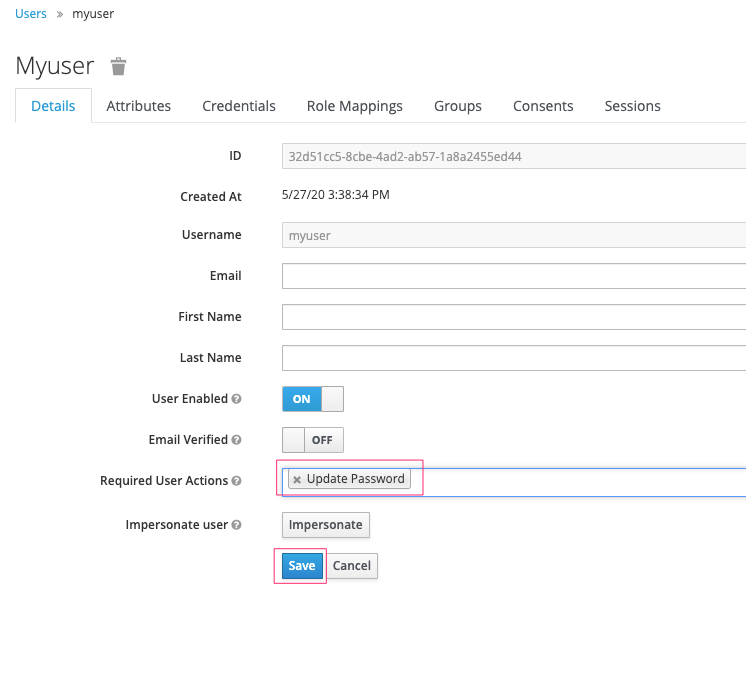
* Try to login with this user and now you'll have to execute the *Required Actions* previously configured;


#### 9. Social Login <a name="demo-step-9"/>

* Go to **JS Console App (http://localhost:80)** and click on **Logout;**

* On **Red Hat Single Sign ON (http://localhost:8080)**, click on **Identity Providers** right bellow the **Roles** at the left menu;
* Select *Github*;
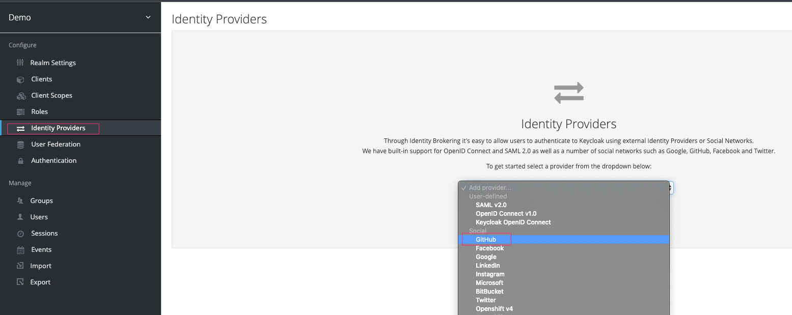
* Now copy the redirect URI

* Open a new tab and access your *Github* account.
  * Select **Settings** 

  * Now go to **Developer Settings** 
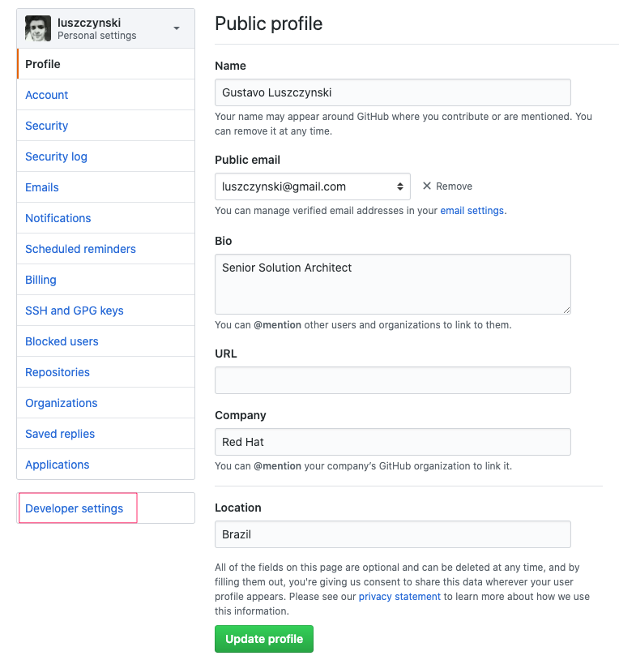
  * Select **OAuth Apps** and finally click on: **Register a new application**

* For *Application name* use `sso`
* *Homepage URL* use `http://localhost`
* *Redirect URI* Copy from **Red Hat Single Sign ON** and paste it on **CallBack URL**
* Click on **Register Application**

* Copy both **Client ID** and **Client Secret** from *Github* and paste them on *RHSSO*


* Click on **Save**
* Go back to **JS Console App (http://localhost:80)** and click on **Login;**

* Notice that now you have the option to login with *Github*;

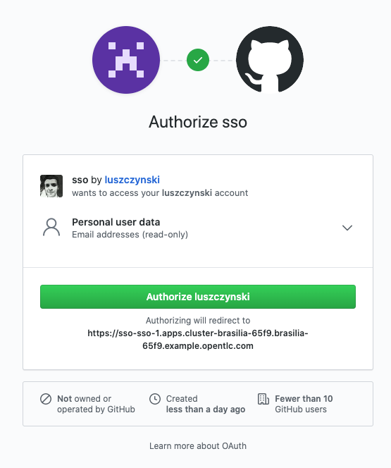

#### 10. Two Factor with OTP <a name="demo-step-10"/>

* On **JS Console App** click on **Logout;**

* On **Red Hat Single Sign ON** click on **Authentication** right bellow the **User Federation** at the left menu;
* Change the default *OTP FORM* from **OPTIONAL** to **REQUIRED**;
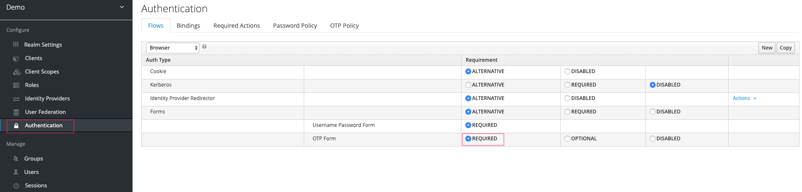
* Go back to **JS Console App (http://localhost:80)** and click on **Login;**

  * Consider installing *FreeOTP* or *Google Authenticator* and configure the authentication by scanning the provided *QR Code*;


#### 11. End User Account Management <a name="demo-step-11"/>

* On **Red Hat Single Sign ON**, click on **Clients** right bellow the **Realm Settings** at the left menu;
* Now click on the Account Base URL link
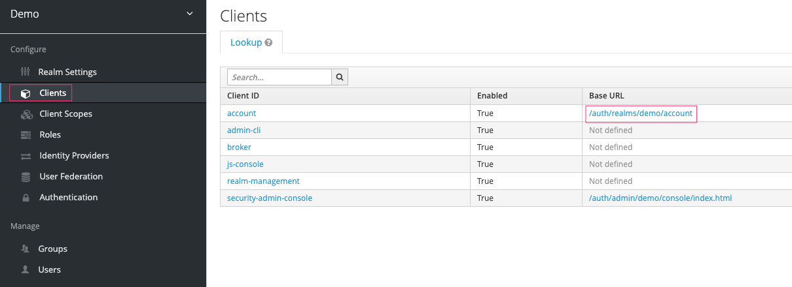
* Navigate through the options and update your profile if desired;

## Additional References <a name="additional-references">
