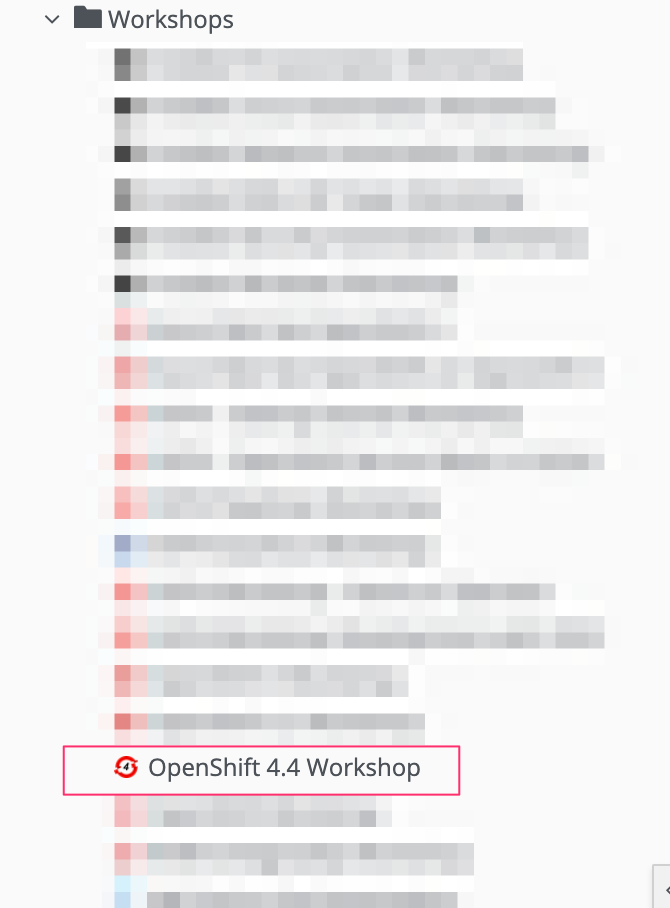
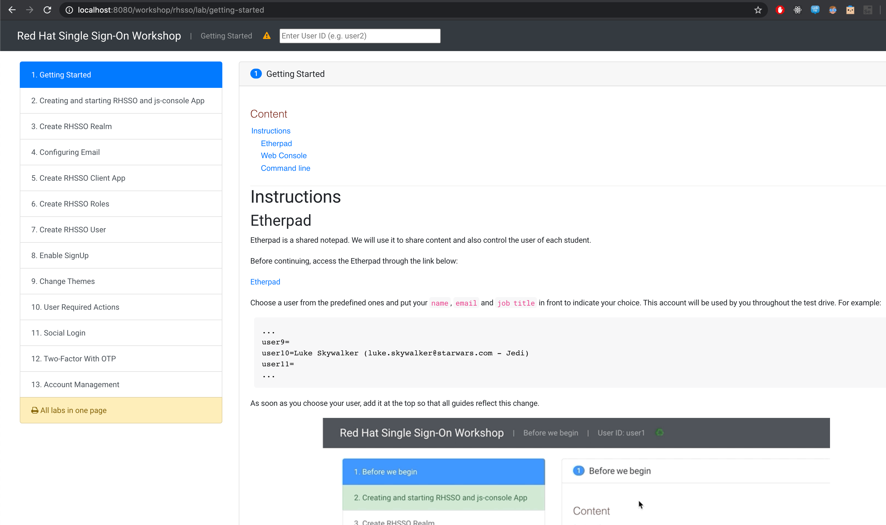

# Red Hat Single Sign On Walkthrough

## Description

This demo showcase a step-by-step guide covering basic capabilities from [Red Hat Single Sign ON](https://access.redhat.com/products/red-hat-single-sign-on) using a simple application js-console.


js-console and Red Hat SSO running on Openshift.


## For instructor only

### RHPDS

If you want to use it on RHPDS, create a new Openshift environment using OCP 4.4.



#### User Projects

```bash
# change this according to the number of expected users
NUMBER_OF_USERS=5

for userNumber in $(seq 1 $NUMBER_OF_USERS); do
  oc adm new-project sso${userNumber} --admin=user${userNumber}
done
```

#### Etherpad

To install etherpad, please check https://github.com/luszczynski/openshift-etherpad

#### Documentation



##### Local

```bash
docker run -it --rm -p 8080:8080 -v $(pwd)/docs:/app-data \
              -e CONTENT_URL_PREFIX="file:///app-data" \
              -e LOG_TO_STDOUT=true \
              -e WORKSHOPS_URLS="file:///app-data/_workshop.yml" \
              quay.io/jamesfalkner/workshopper
```

##### Openshift

To test the documentation, run

```bash
WORKSHOP_URL=https://raw.githubusercontent.com/luszczynski/rhsso-walkthrough/master/docs/_workshop.yml
ISSUES_URL=https://github.com/luszczynski/rhsso-walkthrough/issues
MASTER_URL=https://console-openshift-console.apps.cluster-brasilia-d6ec.brasilia-d6ec.example.opentlc.com/
ETHERPAD_URL=http://etherpad-etherpad.apps.cluster-brasilia-d6ec.brasilia-d6ec.example.opentlc.com/p/workshop
TERMINAL_URL=https://terminal-terminal.apps.cluster-brasilia-d6ec.brasilia-d6ec.example.opentlc.com/
OPENSHIFT_API_URL=https://api.cluster-brasilia-da5c.brasilia-da5c.example.opentlc.com:6443

oc new-project workshopper --display-name="Workshopper"
oc new-app quay.io/jamesfalkner/workshopper --name=workshopper \
      -e WORKSHOPS_URLS="$WORKSHOP_URL" \
      -e ISSUES_URL=$ISSUES_URL \
      -e OPENSHIFT_MASTER_URL=$MASTER_URL \
      -e ETHERPAD_URL=$ETHERPAD_URL \
      -e TERMINAL_URL=$TERMINAL_URL \
      -e OPENSHIFT_API_URL=$OPENSHIFT_API_URL \
      -e LOG_TO_STDOUT=true -n workshopper

oc expose svc/workshopper -n workshopper
```

Here you can see [full documentation](docs.md)